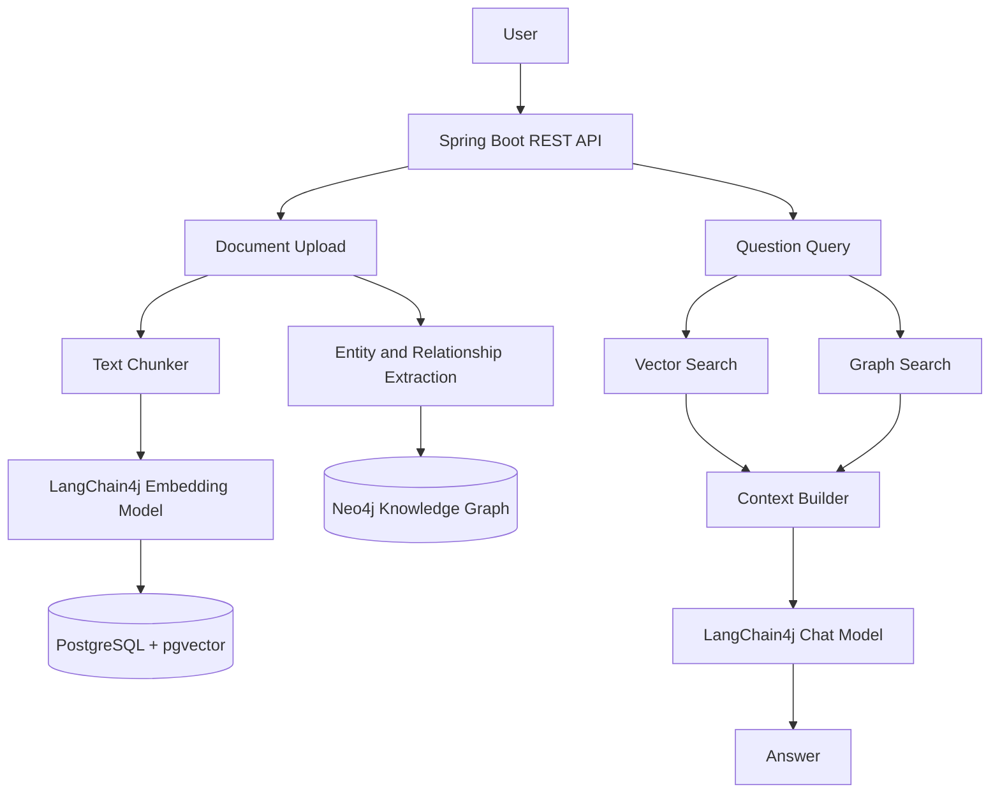

# Intelligent Knowledge Graph RAG Assistant

A beginner-friendly monolithic Spring Boot GraphRAG project.

## Requirements

- Java 17+
- Maven 3.9+
- PostgreSQL with the `pgvector` extension
- Neo4j 5.x
- OpenAI API key for LLM answers and production embeddings (optional while learning)

No Docker, Redis, Kafka, Kubernetes, Spring Security, or microservices are required.

## Run the databases

Create a PostgreSQL database named `graphrag`, install pgvector, and set these environment variables if your credentials differ:

```powershell
$env:DB_URL="jdbc:postgresql://localhost:5432/graphrag"
$env:DB_USERNAME="postgres"
$env:DB_PASSWORD="postgres"
$env:NEO4J_URI="bolt://localhost:7687"
$env:NEO4J_USERNAME="neo4j"
$env:NEO4J_PASSWORD="password"
$env:OPENAI_API_KEY="your-key"
```

The application executes `schema.sql` on startup. It creates `documents`, `document_chunks`, and the pgvector column.

## Run the application

```powershell
mvn spring-boot:run
```

## API examples

```powershell
curl http://localhost:8080/api/hello

curl -F "file=@company.txt" http://localhost:8080/api/documents/upload

curl -X POST http://localhost:8080/api/rag/query `
  -H "Content-Type: application/json" `
  -d '{"question":"What does the document say about AlphaFold?"}'

curl -X POST http://localhost:8080/api/graphrag/query `
  -H "Content-Type: application/json" `
  -d '{"question":"What product was developed by the company acquired by Google?"}'

curl "http://localhost:8080/api/graph/search?question=What%20did%20Google%20acquire"
curl http://localhost:8080/api/graph/entities
```

## Example document

```text
Google acquired DeepMind.
DeepMind developed AlphaFold.
AlphaFold is used for protein structure prediction.
```

## Architecture

The application is a single Spring Boot process. Controllers receive HTTP requests, services coordinate the use case, and the database clients handle persistence.



### Upload flow

1. `DocumentController` receives a TXT `MultipartFile`.
2. `DocumentService` reads the text and saves the original document in PostgreSQL.
3. `TextChunker` splits the text into smaller overlapping pieces.
4. `EmbeddingService` converts every chunk into a numeric vector.
5. `DocumentRepository` stores each chunk and vector in pgvector.
6. `GraphExtractionService` extracts facts such as `Google -[ACQUIRED]-> DeepMind`.
7. `GraphService` stores those facts as Neo4j nodes and relationships.

### Query flow

1. The user sends a question to `/api/rag/query` or `/api/graphrag/query`.
2. The question is embedded using the same embedding approach used for documents.
3. PostgreSQL finds chunks with similar vectors.
4. GraphRAG also searches Neo4j for direct and two-hop relationships.
5. `AnswerService` combines the document context and graph context.
6. LangChain4j sends the context to the chat model and returns the answer.

### Package structure

```text
com.example.graphrag
├── controller    REST endpoints
├── service       Application use cases and orchestration
├── repository    PostgreSQL and pgvector access
├── entity        Database-facing data records
├── dto           HTTP request and response records
├── document      Document concerns as the project grows
├── rag           Chunking, embeddings, and vector retrieval
├── graph         Neo4j driver, Cypher, and graph retrieval
├── ai            LangChain4j models, extraction, answers, and tools
└── exception     Future centralized error handling
```

## Concepts explained

### What is RAG?

RAG means Retrieval-Augmented Generation. Instead of asking an LLM to answer only from its training data, the application first retrieves relevant information from its own documents. That retrieved text is placed in the prompt, allowing the LLM to answer using current and private project data.

The basic flow is:

```text
Question -> Embedding -> Similarity Search -> Relevant Chunks -> LLM -> Answer
```

### What is an embedding?

An embedding is a list of numbers representing the meaning of text. Texts with related meanings should have vectors that are close together. The application embeds both document chunks and user questions, then compares their vectors.

### Why chunk documents?

Large documents should not be sent to the LLM in one request. Chunking makes search more precise, keeps prompts smaller, and allows the application to retrieve only the parts relevant to a question. This project uses small overlapping chunks so that context at a boundary is not lost.

### What is GraphRAG?

GraphRAG combines normal vector retrieval with knowledge graph retrieval. Vector search is good at finding related passages. Graph search is good at following explicit relationships and answering multi-hop questions.

For example:

```text
Google -[ACQUIRED]-> DeepMind -[DEVELOPED]-> AlphaFold
```

The question `What product was developed by the company acquired by Google?` requires two relationship hops. Neo4j can traverse that path directly, while a vector search may retrieve the sentences without reliably combining the relationship chain.

### Why PostgreSQL and pgvector?

PostgreSQL stores the original documents and chunks using familiar SQL tables. pgvector adds a vector column and similarity operators, so the project does not need a separate vector database for its first version.

### Why Neo4j?

Neo4j stores connected facts as a graph:

```text
(Google)-[:ACQUIRED]->(DeepMind)
(DeepMind)-[:DEVELOPED]->(AlphaFold)
```

Nodes represent entities, relationships represent facts, and properties store details such as an entity name. Cypher is Neo4j's query language.

### Why use both databases?

The two stores solve different retrieval problems:

| Store | Best at | Example |
| --- | --- | --- |
| PostgreSQL + pgvector | Meaning-based passage retrieval | Find text related to protein prediction |
| Neo4j | Explicit relationship traversal | Follow Google to DeepMind to AlphaFold |

Using both gives the LLM factual passages plus structured relationship evidence.

### What is LangChain4j?

LangChain4j is a Java library that connects Java applications to language models and embedding models. This project uses it for OpenAI embeddings, chat responses, relationship extraction, and the optional tool-calling endpoint.

### How tool calling works

`GraphRagTools` exposes two small tools:

- `searchDocuments(question)` searches pgvector.
- `searchGraph(question)` searches Neo4j.

The `/api/agent/query` endpoint gives these tools to LangChain4j. The model can decide which tool is useful, receive the tool result, and produce a final response. This is intentionally a small agent instead of a complex autonomous workflow.

## Learning map

- `document`: upload, text extraction, and chunking
- `rag`: embeddings and vector retrieval
- `graph`: Cypher, Neo4j nodes, and relationships
- `ai`: LangChain4j models, extraction, answers, and tools
- `service`: orchestration between the components

Without `OPENAI_API_KEY`, the application still demonstrates the flow using deterministic local embeddings, pattern-based relationship extraction, and retrieved-context fallback answers. Configure the key to activate OpenAI-backed embeddings, entity extraction, answer generation, and tool calling.